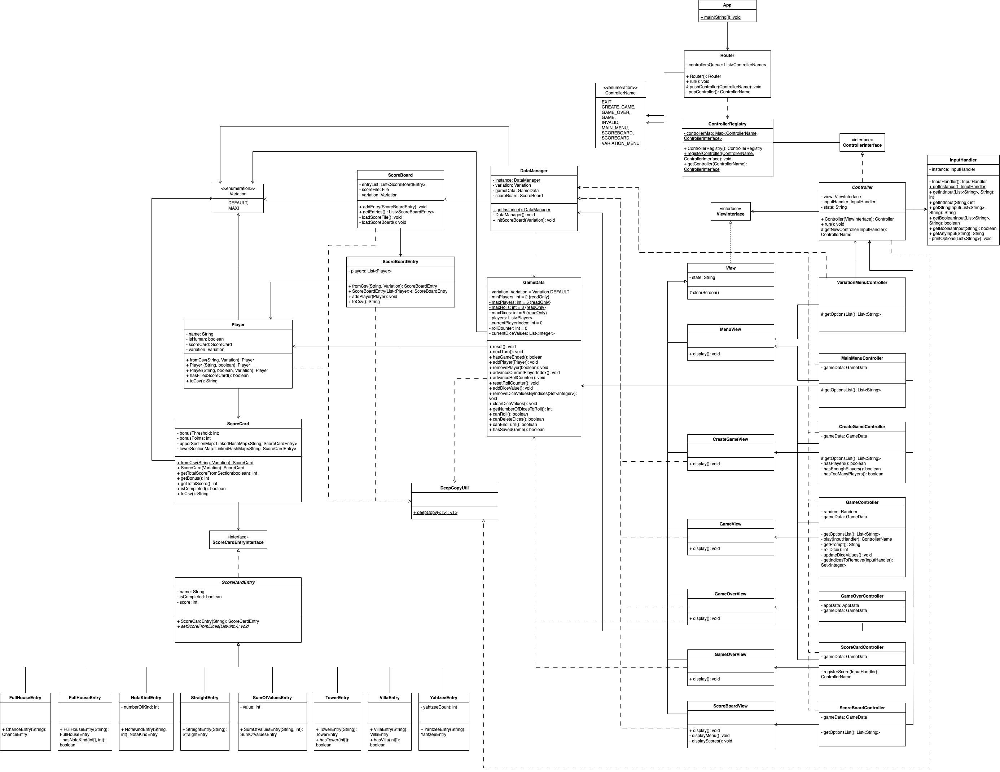
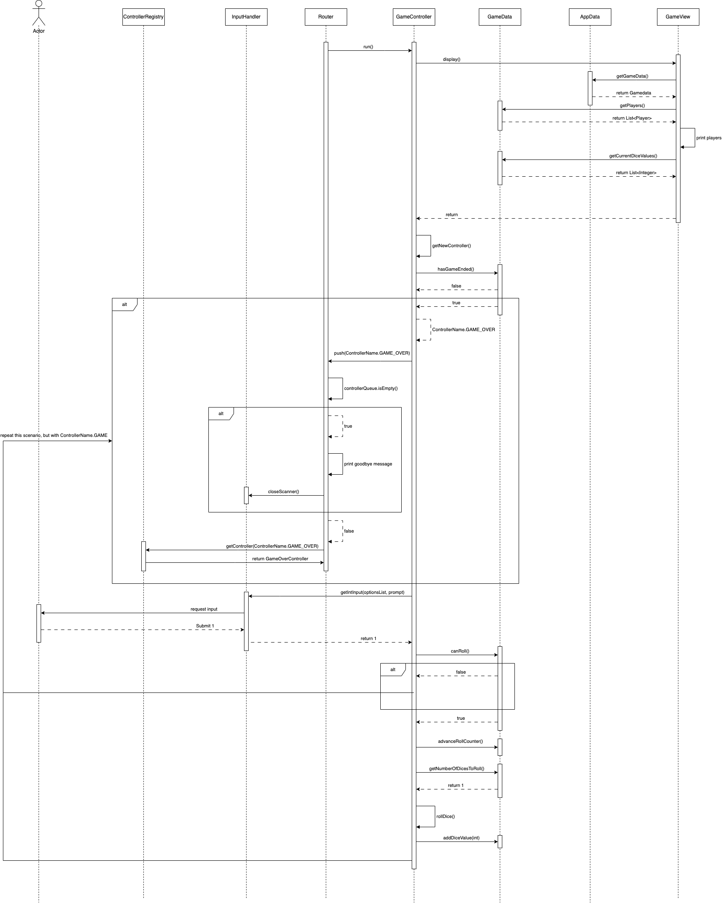
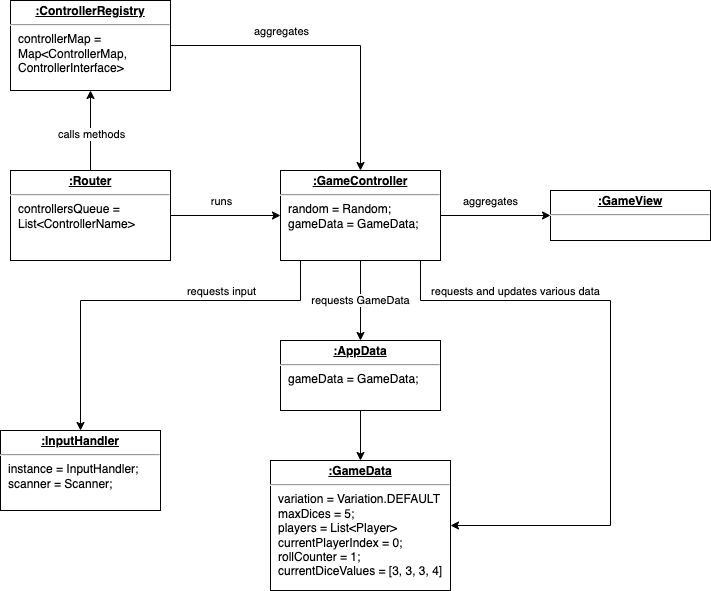

# Boatclub OO-Design
This document describes the design according to the requirements presented in assignment 2.

## Architectural Overview
The application uses the model-view-controller (MVC) architectural pattern. The view is passive and gets called from the controller. The view may only read information from the model, not directly change it.

## Detailed Design
### Class Diagram
There are several key classes in my design:
- Router - responsible for running controllers and keeping track of the order in which to run them
- ControllerRegistry - static class that aggregates a full map of controllers with enum keys assigned to them
- ControllerName - enum used to identify Router which controller to interact with
- InputHandler - a singleton class that handles all user input. Mostly is called in controllers.
- Controller - abstract class that all controllers inherit from. Contains a method to run the controller and a method to get the next controller to run.
- View - abstract class that all views inherit from. Contains a method to display the view.
- AppData - data manager class that manages data flow in the app
- GameData - model class that manages data flow within a single game
- ScoreBoard - model class that contains information about previous games
- Player and ScoreCard are self-explanatory
- ScoreCardEntry - an abstract class that implements ScoreCardEntryInterface via Strategy pattern.

### Sequence Diagram
The sequence diagram below shows the process of rolling a dice within a single game from the moment Router runs GameController to the moment the action is done and it passes controls back to the Router.

You can also see several alternative scenarios that can happend while attempting to roll a dice.

You can also see the scenario that show the way Router operates with several arrows pointing to it to avoid duplicating information.

Here's an object diagram for this sequence diagram representing the state of the objects at the beginning of the sequence diagram.

